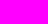
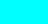
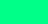
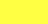

# Interface Guidelines — Estética Cyberpunk

Este documento ofrece indicaciones para el diseñador de interfaces que continuará la línea "cyberpunk" de la aplicación. Las decisiones que se enumeran fueron deducidas del código existente (principalmente `src/domo_tech/ui/styles/cyber_store.py` y `src/domo_tech/ui/branding.py`) y deben ser respetadas o tomadas como base para nuevas propuestas.

**Resumen rápido:** la interfaz es una TUI (Textual) con estética cyberpunk: fondo muy oscuro, acentos neón (magenta/cyan/verde), tipografía monoespaciada para elementos ASCII, bordes y sombreados simulados con niveles de opacidad, y uso frecuente de estados (hover, focus) con intensidades variantes.

## Paleta de colores (colores principales y ejemplos de uso)

- Fondo base: `#05050f` — fondo general de la pantalla.
- Fondo secundario / paneles: `#0a0a1f`, `#0a0a2a`, `#0a0a1f` — cajas, headers y paneles.
- Magenta (primary / acento): `#ff00ff` — títulos, bordes principales, elementos destacados.
- Cyan (accent / secondary): `#00ffff` — badges, headers de carrito, botones secundarios.
- Neon green (success / actions): `#00ff88` — acciones primarias tipo "añadir", totales, estados positivos.
- Amarillo (precio / destacado): `#ffff44` — precios y valores monetarios.
- Error: `#ff3333` — mensajes de error.
- Warning: `#ffaa00` — avisos de registro/registro de errores.
- Texto principal: `#cccccc` — color neutro para textos legibles.
- Texto atenuado / labels: `#666688`, `#888899`, `#555577` — labels y subtítulos.
- Paneles oscuros y separadores: `#1a1a2e`, `#1a1a3a`, `#333344`, `#444455` — bordes y áreas menos prominentes.

### Previsualización de los colores
Los swatches se han añadido como archivos SVG en `docs/assets/swatches/` para asegurar compatibilidad con la previsualización de Markdown en VS Code.

| Swatch | Color |
|---:|:---|
|  | `#05050f` (Fondo base) |
|  | `#ff00ff` (Magenta / Acento) |
|  | `#00ffff` (Cyan / Secundario) |
|  | `#00ff88` (Verde / Acción) |
|  | `#ffff44` (Amarillo / Precio) |

Nota: en la TUI se usan también valores con opacidad simulada como `#ff00ff 12%` o `#00ff88 15%` para fondos y efectos suaves.

## Tipografía y arte ASCII

- Arte ASCII y logotipos están en `src/domo_tech/ui/branding.py` y están diseñados para mostrarse con tipografía monoespaciada. Mantener monoespacio para estos elementos.
- Para una versión GUI (si se llegara a implementar), se recomiendan tipografías con estética techno/cyber como "Share Tech Mono", "Orbitron", o similares; en TUI, confiar en la monoespaciada del terminal.
- Los encabezados en la TUI usan `text-style: bold` para resaltar.

## Componentes y reglas de estilo (por componente)

- Login box
  - Caja centrada con `background: #0a0a1f` y `border: heavy #ff00ff`.
  - Logo en `#ff00ff`, etiqueta secundaria `#00ffff`.
  - Inputs: fondo `#0d0d2b`, texto `#00ff88`, borde `#ff00ff` (focus más intenso y fondo `#111133`).
  - Primary button (`#btn-login`): fondo `#ff00ff` con variaciones de opacidad y color de texto que cambia a blanco en hover.
  - Secondary button (`#btn-register`): fondo `#00ffff` (simétrico a magenta).

- Headers y barras de estado
  - Header principal del store: fondo `#0a0a1f`, borde inferior `#ff00ff`.
  - Texto de título en `#ff00ff` y badges de usuario en `#00ffff`.
  - Barra de estado con `border-top: solid #ff00ff 25%` y texto en `#00ff88`.

- Tablas / DataTable
  - Background: `#05050f`, header: `#0a0a2a` con texto `#ff00ff` en bold.
  - Cursor/selección: `#ff00ff` 25% con texto blanco.
  - Hover: `#ff00ff` 10%.

- Panel de productos
  - Panel productos con borde derecho `#ff00ff 40%`, encabezado con fondo `#ff00ff 12%`.
  - Filtros usan `#ff00ff` como color base; al focus pasan a `#00ff88`.

- Carrito
  - Header: `#00ffff` 12% con borde `#00ffff`.
  - Cantidades y totales: `#00ff88`, precios en `#ffff44` y botones de checkout en `#00ffff`.
  - Items: hover con `#00ffff 05%`.

- Botones y estados
  - Botones primarios → verde `#00ff88` o magenta `#ff00ff` según contexto.
  - Hover/Focus: incrementar opacidad del fondo y cambiar texto a `#ffffff`.
  - Bordes: estilos `tall`, `heavy` se usan para reforzar el look de "paneles luminosos".

## Efectos, espaciado y tamaños

- Unidades de tamaño en TUI suelen ser enteras (por ejemplo `width: 64`, `height: 2`, etc.). Mantener proporciones y no usar valores fraccionales inesperados.
- Padding y margins: la convención usada es `padding: 2 3`, `margin-top: 1` — mantener esa escala (1–4) para coherencia.
- Uso de opacidades: simular brillos usando porcentajes (`#color 10%`, `20%`, `40%`) para fondos y hover.

## Accesibilidad y contraste

- Mantener contraste alto en texto principal vs fondo oscuro (p. ej. `#cccccc` sobre `#05050f`).
- Reservar colores intensos (magenta/cyan/verde) para elementos interactivos y estados.
- Evitar usar solo color para transmitir información: complementar con texto, iconos o estilos (bold, bordes).

## Iconografía y símbolos

- Se utilizan emojis y símbolos en los banners y logos (`⚙️`, `🔧`, `🏠`, etc.). Mantener coherencia de significado cuando se usen nuevos iconos.
- Para badges y pequeños indicadores, preferir símbolos simples y legibles en monoespacio.

## Reglas para el diseñador

- No cambiar la paleta principal sin proponer equivalentes que mantengan el mismo contraste y sensación neón.
- Seguir usando monoespacio para arte y encabezados ASCII; para textos largos, priorizar legibilidad con monoespacio o una fuente techno legible.
- Mantener los estados de interacción (hover, focus) con aumentos de opacidad y cambio a texto blanco cuando aplique.
- Usar los hex y clases existentes como primera referencia: `#ff00ff`, `#00ffff`, `#00ff88`, `#ffff44`, `#ff3333`, etc.
- Cuando propongas variaciones, incluye mockups en escala de 80–100 caracteres (TUI) y también una versión sencilla para posible GUI.

## Archivos de referencia (código fuente)

- `src/domo_tech/ui/styles/cyber_store.py` — definición principal de estilos (colores, bordes, tamaños, estados).
- `src/domo_tech/ui/branding.py` — logos ASCII y banners que establecen la identidad visual.

## Ejemplo rápido (colores principales)

- Primary magenta: `#ff00ff` (títulos, bordes)
- Secondary cyan: `#00ffff` (badges, headers carrito)
- Action green: `#00ff88` (botón add/confirm)
- Background: `#05050f` / `#0a0a1f`

## Entregables sugeridos para continuar

- Un set de mockups TUI (login, store, cart, modal de detalles) mostrando estados idle/hover/focus.
- Variantes de botones (primary, secondary, danger, disabled) con códigos de color y comportamiento hover/focus.
- Un pequeño sprite o plantilla ASCII para nuevos banners que respete la anchura de la TUI.

## Acerca del Marquee para tooltips en la ventana de administración

El tiempo de espera entre mensajes se define en dos sitios: el intervalo del timer self.set_interval(0.15, self._scroll_status) y el contador self._status_hold_remaining = 16 dentro de _activate_section_tips(...). Con esos valores, el texto “se queda” aproximadamente 
16 × 0.15 = 2.4 16×0.15=2.4 segundos antes de pasar al siguiente tip.

---

Si quieres, puedo:

- Generar mockups TUI de ejemplo en texto (p. ej. login y store) para validar los estilos.
- Extraer automáticamente una tabla con los colores detectados y sus usos exactos en el código.

Indica si prefieres que genere los mockups o la tabla de colores automáticamente y lo hago a continuación.
